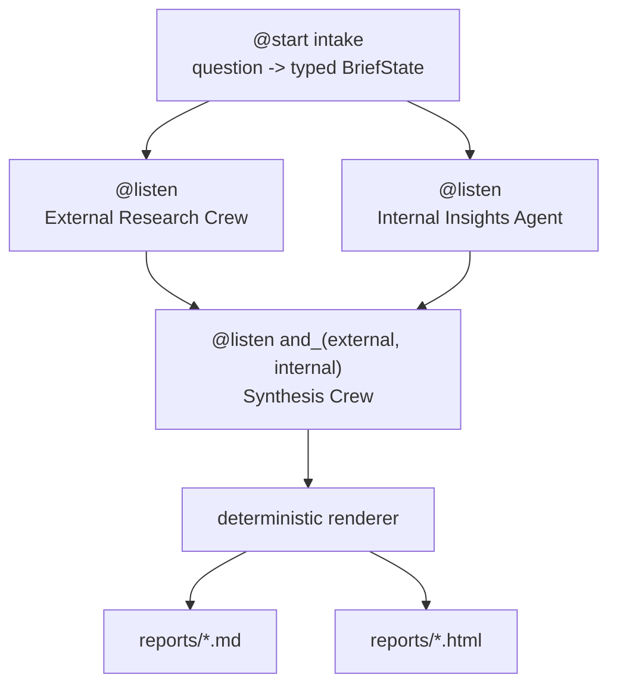

# Frio Market Intelligence Brief

A multi-agent deep research system built on CrewAI (FDE take-home,
Option 1: Deep Research Agent).

## What this is

Frio Beverage Company is a fictional Fortune-500-scale CPG beverage
manufacturer. Today, when an executive asks a market question ("should we
enter the functional beverage category?"), Frio's strategy team takes two
to three weeks to answer it, so decisions land on stale data. This system
takes the same kind of question and produces a cited, board-ready research
brief in under a minute, combining live external market research with
Frio's own internal sales, brand, and strategy data. It compresses a
weeks-long analyst cycle into a self-serve, minutes-long one.

## Quickstart

```bash
uv sync
cp .env.example .env   # then add OPENAI_API_KEY and SERPER_API_KEY
uv run python -m frio_intel.main
# or: crewai run
```

Output lands in `reports/` as a Markdown file and a branded HTML file,
named from the question. A full run costs pennies and takes under a
minute on the shipped mini-tier model. Running the default question
regenerates the committed sample report pair in place, so you can
`git diff` your run against the committed reference.

## Architecture



A CrewAI **Flow** (`MarketBriefFlow`) orchestrates crews; the topology is
fixed and agents work inside it. Four agents total:

| Agent | Branch | Tools | Feeds report sections |
|---|---|---|---|
| Market Researcher | external | Serper search, scrape | Market Landscape, Competitive Dynamics (raw cited findings) |
| Market Analyst | external | none | Market Landscape, Competitive Dynamics (insight layer) |
| Internal Analyst | internal | CSV/JSON/text file readers over `data/` | Frio's Position, internal history |
| Strategy Writer | synthesis | none | all sections (populates the report schema) |

Measured parallel timings from a live run: both branches start within
~0.6s of intake; the internal branch finishes in ~11.5s; the external
branch (live web search) finishes in ~27.3s; the full flow completes in
under a minute end to end.

Core design stance: **agents decide what to say; they never decide what
happens next.** Flow topology, the typed `BriefState`, the report contract
(`output_pydantic=ExecutiveBrief`), and rendering are all deterministic and
identical on every run. Search queries, source selection, and analysis
prose vary per run - that variance is the point of a research agent, and
it is contained entirely inside content, never inside control flow.

## Design decisions

Full rationale in [`docs/DESIGN.md`](docs/DESIGN.md). Summary:

- **Flow + crews, not one big crew.** The Flow owns deterministic
  structure (branching, merging, the report contract); crews own the
  probabilistic work (research, analysis, writing) inside each step.
- **Heterogeneous parallel branches, not N identical fan-outs.** The two
  parallel branches are different kinds of research - open-ended web
  research vs. bounded internal file analysis - merged with `and_()`.
  Combining internal and external evidence is the point of the system, so
  the topology states it directly.
- **JSONC-configured research crew vs. code-defined synthesis crew:
  config where the customer tunes, code where the contract lives.** The
  external research crew's agents and tasks live in `crew.jsonc` +
  per-agent JSONC files (loaded via `load_crew`), so a non-engineer can
  retune a researcher's instructions without touching code. The synthesis
  crew is defined in Python because it carries the deterministic
  `output_pydantic=ExecutiveBrief` contract, which must not drift.
- **Solo internal agent, not a crew.** Bounded file analysis over three
  static files doesn't need a crew's gather/analyze split; one agent with
  `FileReadTool` is the right amount of machinery.
- **Mini-tier LLM, env-swappable.** The shipped default is a cost-effective
  OpenAI mini model; model choice matters less than system design, and
  swapping providers is a one-line env change (commented Anthropic and
  Gemini alternatives in `.env.example`). Direct provider keys by design:
  enterprise deployments get model flexibility through their own cloud
  provider or direct contracts, not third-party proxies.
- **`@router` deliberately unused.** This use case has no control-flow
  decision that should be delegated to a model - the flow always runs both
  branches and always synthesizes. A production version would add a router
  to gate off-topic questions into clarification before running research.

## Mock data

All "internal" data in `data/` is synthetic, generated deterministically
(`scripts/generate_mock_data.py`) and modeled on real public beverage
category trends, so the numbers are plausible. Frio itself is a fictional
company on purpose: in a real engagement this data lives behind the
customer's firewall, and a fictional customer means no real company's
internal figures get fabricated.

## What's reusable

The Flow topology, the crew structure, and the report contract are
vertical-agnostic. To retarget this system at a different customer or
question domain, swap:

- the internal file tools and the files in `data/` for the new customer's
  data shape and connectors,
- the `ExecutiveBrief` schema for that vertical's report contract,
- the JSONC research crew's task descriptions for the new domain.

The Flow (`@start` / parallel `@listen` / `and_()` merge / synthesis /
render) and the synthesis crew's code do not need to change.

## Path to production

What would change for a real deployment: internal connectors (warehouse,
SharePoint/Drive, BI exports) behind the customer's firewall instead of
static files; an HITL checkpoint where an analyst reviews sources before
synthesis; scheduled and event-triggered runs (competitive monitoring);
report template variants per audience (deck, email digest); observability
and cost controls via the platform; SSO/RBAC. The Flow, crews, and report
contract are unchanged: the reusable core is the orchestration pattern plus
the schema, and the swappable edges are tools and templates.

## Testing

Deterministic shell components are unit-tested with pytest: the report
contract and renderer (fixture `ExecutiveBrief` -> Markdown/HTML), the
mock data loaders, the external/internal crew wiring, and the Flow's
branch/merge wiring with mocked branches.

Agent output quality is validated by inspection of the committed sample
report in `reports/`, not by an automated eval harness. That's a
deliberate prototype trade-off: the deterministic shell has full test
coverage because it's where a regression would silently break every
report; agent output quality is judged the way it's judged in
production research work - by reading the output.

## AI assistance note

Built with AI-assisted developer tooling, as invited by the brief; all
design decisions and code are mine and defensible line-by-line.
